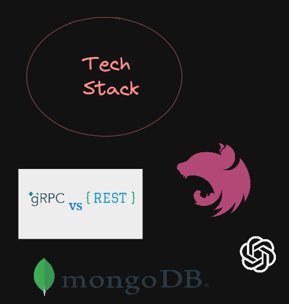

## Definitions that the comments in the code uses.

> **Core API**: Happly API.  
**This microservice** / **software**: The current microservice (the current codebase).  
**Admin Portal**: The admin portal that is used to manage the opportunities (aka. funding-scraper repository).

# Funding Microservice
The funding microservice is a microservice that is used to scrape funding opportunities given a URL.
It is used to scrape using chatGPT and store the extracted information in a database and to provide
an API to the admin portal to fetch the funding opportunities.

## How it works
Scraper Microservice is used for scraping the funding opportunities from the given URL(s). When given a URL or a sets of
URLs, it will start scraping and extracting information from the webpage.

The software can process multiple URLs simultaneously. However, it has a limit of 10 URLs at a time. This is to prevent
the ChatGPT API from reaching to its rate-limits. The software will queue the URLs and process them later when the current
processing URLs are done scraping.

After a process is done extracting, it will release the URL from the queue and start processing the next URL in the queue
(if there is any).

The software will also check if the URL is already in the database. If it is, it will overwrite the fields that are allowed
to be overwritten. If it is not, it will create a new entry in the database.

When the requested fields are not found in the webpage, the software will try to scrape the missing information from a 
different relevant webpage. For example, if the requested fields are `title`, `description`, `deadline`, `amount`, and
`link`, but the webpage only contains `title`, `description`, and `deadline`, the software will try to scrape the missing
information from the relevant link (found by ChatGPT) separately.

_Note_: Microservice will only recurse to the relevant URLs one level max. If the relevant link contains a relevant link,
it will not scrape the relevant link from the relevant link since it is already a second level of recursion.

## How to Run the Microservice
### Prerequisites
- MongoDB (tested with: v1.8.0)
- NPM (tested with: v8.5.5)
- Node.js (tested with: v18.12.1)
- ChatGPT API key

### Steps
~~1. Clone the repository.~~
```bash
```

2. Install the dependencies.
```bash
npm install
```

3. Create a `.env` file from `.env.example` in the root directory of the project and make sure
you fill in the following fields (**required**):
```dotenv
# MongoDB
MONGO_URI="<MongoDB URI>"

# OpenAI
OPENAI_API_KEY=""
OPENAI_ORG_ID=""
```

4. Build and Run the Microservice.
```bash
# In Development
npm run start:dev

# In Production
npm run build
npm run start:prod
```

## TODO
- [ ] Make sure all the fields are scraped correctly.

## Tech Stacks


